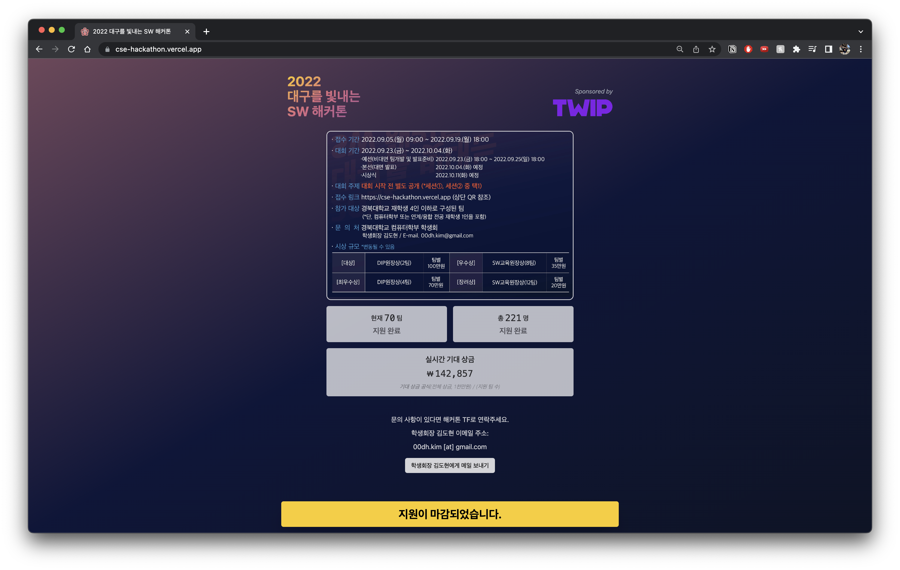
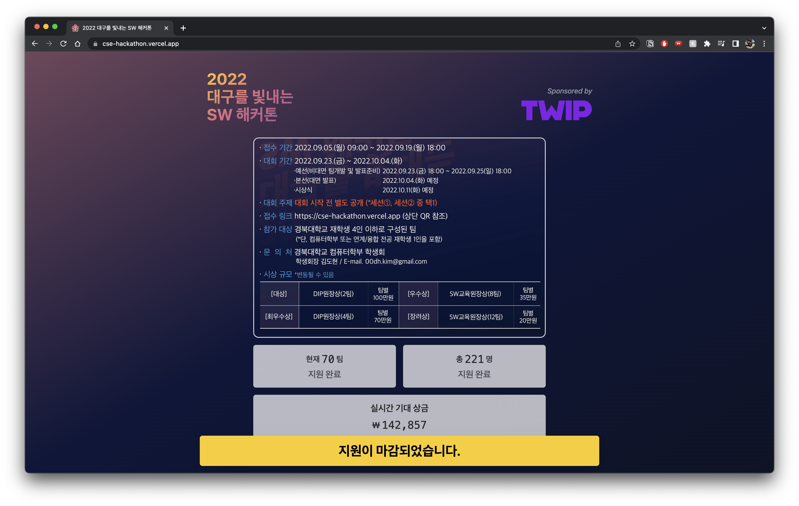
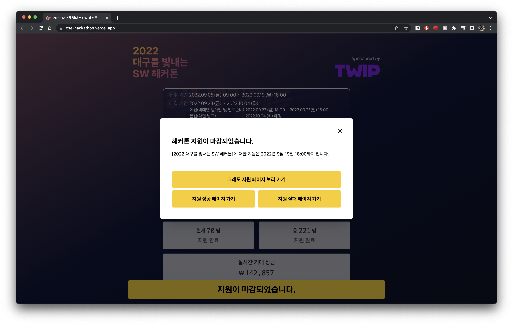
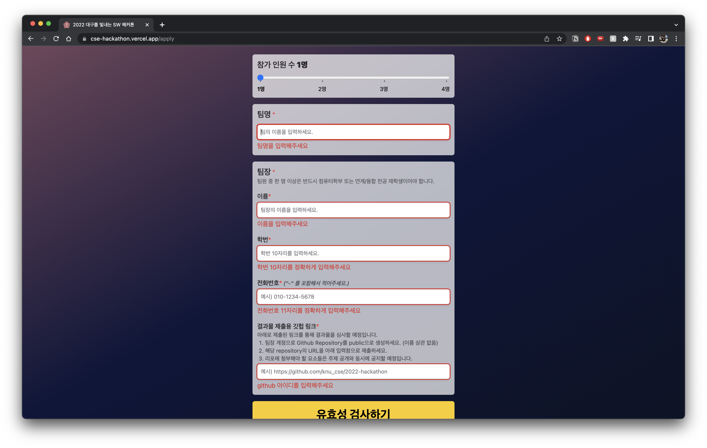
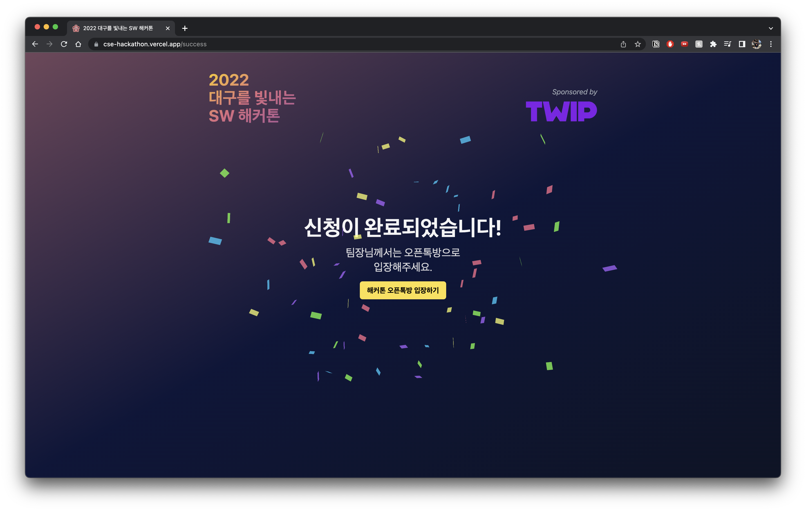

# 2022 대구를 빛내는 SW 해커톤

"2022 대구를 빛내는 SW 해커톤"은 경북대학교 컴퓨터학부에서 주관한 해커톤입니다.

## 사이트 개관

## 지원 폼에 대한 결과

- 해커톤 기획 당시 잡은 지원 규모는 약 50팀의 180명이었습니다.
- 접수 기간은 9월 05일 (월) ~ 9월 19일 (월)로 14일이었습니다.
- 14일 접수 기간 동안 총 70팀, 221명이 해커톤에 지원해주었습니다.
- 접수 기간 동안 지원자분들께서 데이터를 잘못 입력하신 적은 있었지만 접수 중 데이터에는 문제가 발생하지는 않았습니다.

### 프로젝트에 쓴 노력

- `create-t3-app`을 이용해 프로젝트를 구성했습니다.
  - `typescript`를 효율적으로 사용하기 위해
  - `vercel`을 통한 편리한 배포를 위해
- `zod`와 `react-hook-form`을 사용하였습니다.
  - 오류 없는 폼을 구성하기 위해
- `tailwindcss`를 사용했습니다.
  - 쉽고 간단하면서 정확한 **css**를 사용하기 위해

### Acquisition Overview

#### 결과

총 **533**명이 해커톤 지원 폼에 접속하였습니다.

#### 채널 별 분석

- 외부 사이트에서 링크를 타고 넘어온 사람(Referral)의 수는 **321**명으로 가장 많은 비중(**60%**)을 차지했습니다.
- 그 다음으로 직접 사이트의 주소를 치고 들어온 사람(Direct)의 수는 **194**명(**36%**)을 기록했습니다.
- 서치 엔진을 타고 넘어온 사람(Organic Search)의 수는 **14**명(**3%**)이었습니다.
  - 서치 엔진에 노출시킨 적이 없었는데 어떻게 해당 지표가 기록되었는지 잘 모르겠습니다. 나중에 따로 찾아봐야겠습니다.
- 인스타그램 등의 SNS를 통해서 접속한 사람의 수는 **4**명(**1%**)이었습니다.
  - SNS 채널을 통한 광고는 크게 효과가 없는 것 같습니다.

### Engagement Overview

#### 결과

- 평균 참여 시간은 **1분 20초**였습니다.
  - 다른 지표에서는 평균 참여 시간이 **5분** 정도로 기록되었습니다.
  - **1분 20초**는 폼을 다 작성하기에는 적은 시간이라고 생각되는 수치입니다.
  - 아마도 랜딩 페이지의 시간과 전체 폼 작성 시간의 평균으로 **1분 20초**라는 값이 나온 것 같습니다.
- 유저당 참여한 세션은 **1.3회**였습니다.
  - 접속한 모든 사람이 1번 이상 참여한 것을 알 수 있습니다.
- 총 조회 수는 **2,523회**였고 총 이벤트 수는 **6,415회**였습니다.
  - 이렇게 큰 수는 처음이라 기쁩니다.
